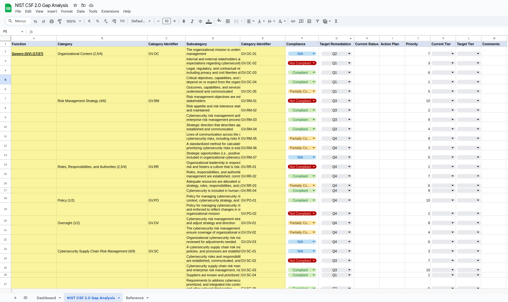

# NIST CSF 2.0 Cybersecurity Dashboard

This project provides a free and user-friendly spreadsheet designed to help small teams or organizations focus on the essentials of the NIST CSF 2.0. It includes dashboards that automatically calculate compliance, target remediation distribution, and prioritize controls based on your current cybersecurity posture.

### Key Features
- **Dashboard for Controls by Category**: Displays the distribution of applicable controls by category (e.g., Governance, Identify, Protect, Detect, Respond, Recovery).
- **Overall Compliance Status**: Automatically calculates the percentage of compliant, partially compliant, and non-compliant controls.
- **Target Remediation Distribution**: Provides a distribution of controls' target remediation across different quarters (Q1-Q4).
- **Target Controls per Quarter**: Displays the number of controls per category for each quarter, ensuring proper alignment with the remediation timeline.
- **Control Prioritization**: Automatically sorts and prioritizes controls based on defined criteria, such as compliance status and target remediation dates.

### Purpose
This tool simplifies the process of managing and prioritizing cybersecurity efforts for teams starting with NIST CSF 2.0. By organizing data and visualizing key metrics, small teams can easily identify gaps and focus on the most important areas of improvement.

## Dashboard Overview
Here's an example of how the dashboard looks with data filled in:

### How It Works
The dashboard and detailed analysis are created from two sheets:
1. **Sheet 1: Dashboard**  
   - Displays key metrics, such as overall compliance, control categories per quarter, and the sorted list of controls based on target quarter and priority.
2. **Sheet 2: Control Data**  
   - Contains detailed information about each control in NIST CSF 2.0, including compliance status, priority, target remediation date, and other relevant data.

## Example Spreadsheet

Here is an example of what the spreadsheet looks like when filled with data:

### How to Use
1. Download the **template spreadsheet** to set up your own organization's data.
2. Alternatively, download the **example spreadsheet** to see a sample with pre-filled data.
3. Update the control data in Sheet 2 with your organization's NIST CSF 2.0 controls, including the compliance status, target remediation quarter, and priority.
4. The dashboards on Sheet 1 will automatically update based on the new data.

### Requirements
- **Google Sheets** or **Excel** for viewing and editing.
- Familiarity with the **NIST CSF 2.0 framework** for accurate data entry.

### Contributions
Contributions are welcome! If you have suggestions, improvements, or bug fixes, feel free to open an issue or submit a pull request.

### Acknowledgements
- NIST CSF 2.0 Framework (https://www.nist.gov/cyberframework)